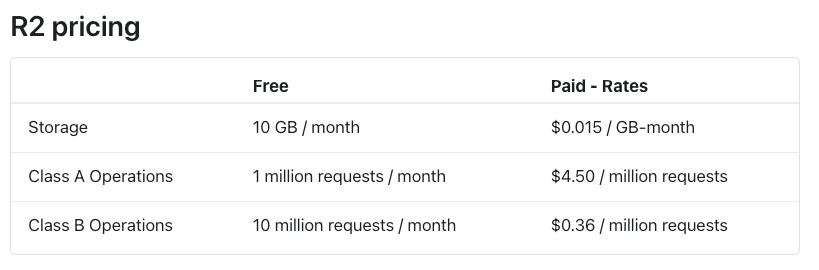

###导航网站自动化icon

#### 1. 项目介绍
- 自制导航网站通常会需要显示一个网站图标方便用户识别，目前常规的做法是添加网站链接的时候上传网站的图片，
实际上每个网站的图标都是固定的，用户收藏的网站也基本是重复的，所以当出现网站链接的时候，网站图标可以自动不全

#### 2. 背景调查
目前已知的网站图标服务有一下几个
##### 1. 下面的是copilot自动生成的
- [favicon](https://www.favicon.cc/)
- [iconfont](https://www.iconfont.cn/)
- [iconify](https://iconify.design/)
- [iconfinder](https://www.iconfinder.com/)
- [iconmonstr](https://iconmonstr.com/)
- [flaticon](https://www.flaticon.com/)
- [fontawesome](https://fontawesome.com/)
- [iconscout](https://iconscout.com/)
- [iconarchive](http://www.iconarchive.com/)
- [iconshock](https://www.iconshock.com/)
- [iconspedia](http://www.iconspedia.com/)
- [iconbug](http://www.iconbug.com/)
- [iconseeker](http://www.iconseeker.com/)
- [iconexperience](http://www.iconexperience.com/)
- [iconlook](http://www.iconlook.com/)
- [iconlet](http://www.iconlet.com/)
- [iconbazaar](http://www.iconbazaar.com/)
- [icondrawer](http://www.icondrawer.com/)
- [iconeden](http://www.iconeden.com/)
- [icondock](http://www.icondock.com/)
- [iconfu](http://www.iconfu.com/)
- [iconpot](http://www.iconpot.com/)
- [iconspedia](http://www.iconspedia.com/)
- [iconwanted](http://www.iconwanted.com/)
- [iconza](http://www.iconza.com/)
- [iconzoo](http://www.iconzoo.com/)
- [iconarchive](http://www.iconarchive.com/)
- [iconbug](http://www.iconbug.com/)

##### 2. 开发过程中搜索到的
- [gstatic]('https://t1.gstatic.com/faviconV2?client=SOCIAL&type=FAVICON&fallback_opts=TYPE,SIZE,URL&url=http://cloudflare.com&size=256') 可以通过指定size参数来获取不同尺寸的图标
- [faviconkit]('https://parental-peach-bat.faviconkit.com/cloudflare.com/256) 可以指定尺寸获取图标
- [besciocn]('https://besticon-demo.herokuapp.com/icon?size=80..120..200&url=github.com') 开源项目，可以自己部署，有接口可以返回多个不同尺寸的图标
- [google]('https://www.google.com/s2/favicons?domain_url=http://cloudflare.com') 也是谷歌的，会跳转到gstatic
- [duck duck go]('https://icons.duckduckgo.com/ip2/github.com.ico') 无法控制icon的尺寸，目前openai也在使用这个服务

#### 3. 存储方案
  目前是通过cloudflare R2存储，有10g免费空间，每个月1 million读10 million写
  
  

#### 4. TODO
- [x] 数据要尽量全面，目前收集了1million的站点，后面尽量做到每个国家都有这么多
- [x] 数据保持更新的问题
- [x] 目前下载的都是ico图片，无法满足图片格式和尺寸多样性的要求，最少要保留一份svg格式的
- [x] 要模仿[simpleicons.org](https://simpleicons.org/) 允许用户定制icon的颜色
- [x] 要模仿[iconify](https://iconify.design/) 允许用户定制icon的尺寸
- [x] 考虑图片拼接的问题 http://favicon.yandex.net/favicon/google.com/stackoverflow.com/yandex.net/
- [x] 不通终端下用户对图片多样性的要求